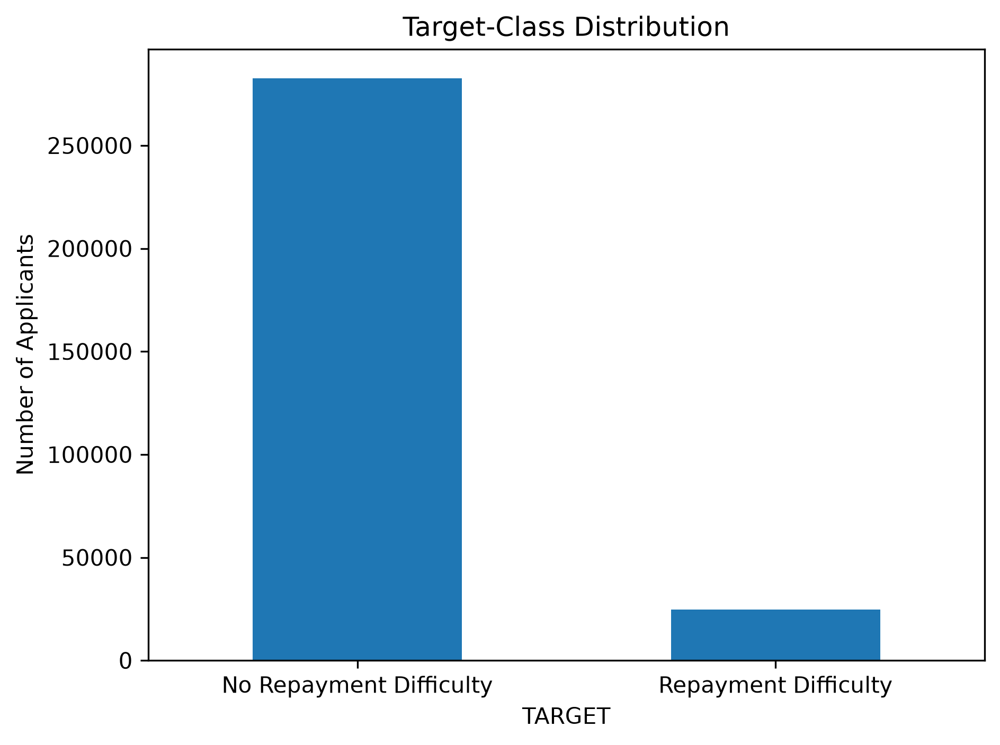
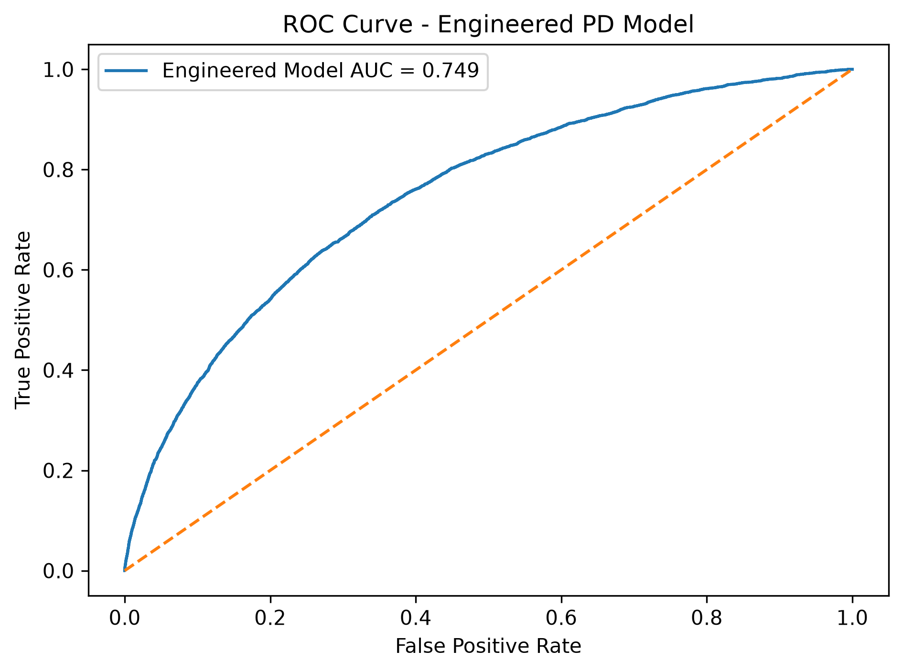
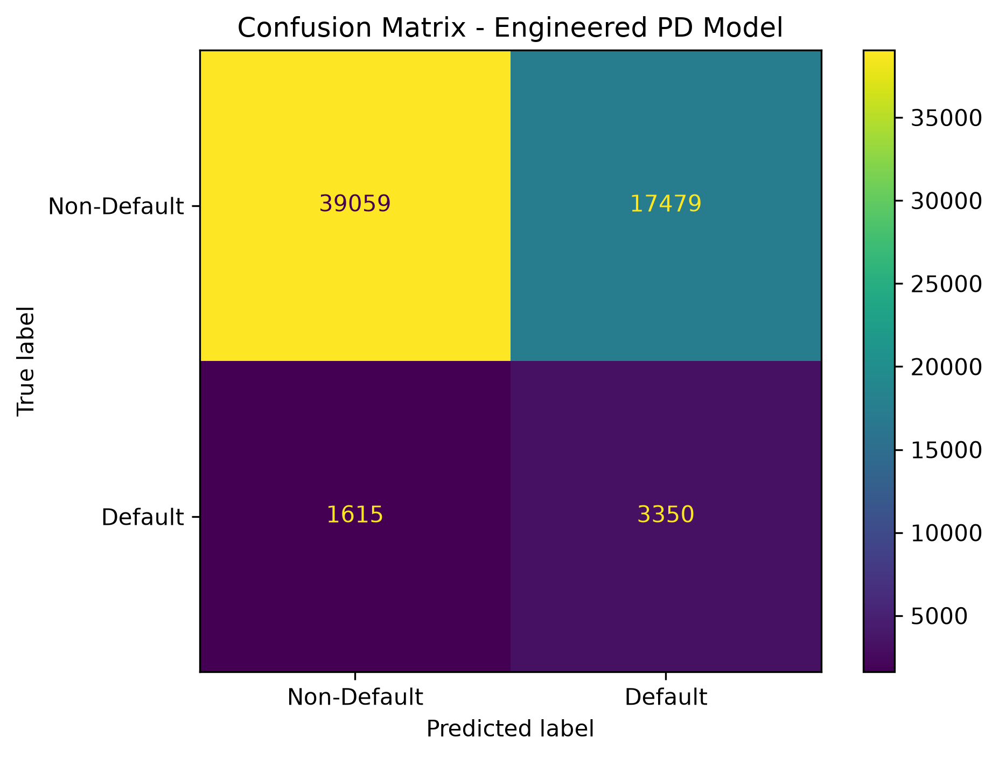

# Home Credit Default Risk Modelling

An end-to-end credit-risk modelling project using the **Home Credit Default Risk** dataset to estimate the likelihood of repayment difficulty among loan applicants.

The project combines exploratory data analysis, feature engineering, Probability of Default modelling, model validation, borrower risk segmentation and Expected Loss analysis. The objective is not only to build a predictive model, but also to translate its outputs into practical credit-risk insights.

---

## Business Problem

Financial institutions must identify applicants who are more likely to experience repayment difficulty while avoiding the unnecessary rejection of creditworthy customers.

This creates an important trade-off:

- Approving a high-risk applicant can increase future credit losses.
- Rejecting a creditworthy applicant can result in lost business and poor customer experience.

This project develops a structured credit-risk framework to support more informed lending decisions using applicant-level financial, demographic and credit-related information.

---

## Project Objectives

- Understand the structure and quality of the Home Credit application data.
- Analyse repayment difficulty and target-class imbalance.
- Identify important applicant and affordability-related risk variables.
- Develop an interpretable baseline Probability of Default model.
- Engineer additional features to improve model performance.
- Validate the model using appropriate classification and ranking metrics.
- Evaluate alternative decision thresholds.
- Segment applicants into meaningful risk categories.
- Demonstrate Expected Loss estimation using PD, LGD and EAD.

---

## Project Status

- [x] Repository structure and environment setup
- [x] Data understanding
- [x] Exploratory data analysis
- [x] Missing-value and feature-type analysis
- [x] Baseline Probability of Default model
- [x] Feature engineering
- [x] Model validation
- [x] Borrower risk segmentation
- [x] Expected Loss framework
- [x] Final project documentation

---

## Methodology

The project follows the workflow below:

1. **Data understanding**  
   Reviewed dataset dimensions, target definition, feature types and data quality.

2. **Exploratory data analysis**  
   Analysed repayment difficulty, class imbalance, applicant characteristics and selected risk variables.

3. **Missing-value and feature analysis**  
   Assessed missingness, numerical and categorical variables, and potential modelling challenges.

4. **Baseline Probability of Default model**  
   Developed an interpretable baseline model to establish a performance benchmark.

5. **Feature engineering**  
   Created additional applicant, affordability and credit-related variables.

6. **Model validation**  
   Evaluated predictive performance, ranking ability, classification outcomes and threshold trade-offs.

7. **Expected Loss framework**  
   Combined predicted PD with LGD and EAD assumptions or estimates to demonstrate portfolio-level loss analysis.

---

## Notebook Guide

| Notebook | Description |
|---|---|
| `01_data_understanding.ipynb` | Dataset structure, target variable, feature types and initial data-quality assessment |
| `02_application_train_eda.ipynb` | Exploratory analysis of applicants, repayment difficulty and class imbalance |
| `03_missing_values_and_feature_types.ipynb` | Missing-value patterns and numerical/categorical feature analysis |
| `04_baseline_pd_model.ipynb` | Baseline Probability of Default model and initial evaluation |
| `05_feature_engineering_application_data.ipynb` | Creation and assessment of additional risk-related variables |
| `06_model_validation.ipynb` | Model performance, threshold analysis and validation |
| `07_expected_loss_framework.ipynb` | Expected Loss estimation using PD, LGD and EAD |

---

## Dataset

This project uses the **Home Credit Default Risk** dataset available through Kaggle.

The target variable identifies applicants who experienced repayment difficulty.

Raw data files are excluded from this repository because of their size. After downloading the dataset, place the required files inside:

```text
data/raw/
```

The primary file used in the initial modelling workflow is:

```text
application_train.csv
```

---

## Feature Engineering

The feature-engineering stage includes selected variables related to applicant affordability, credit exposure and financial capacity.

Examples may include:

- Credit amount relative to applicant income
- Loan annuity relative to applicant income
- Credit amount relative to goods price
- Applicant age
- Employment duration
- External credit-score combinations
- Document and information availability indicators

Only variables implemented in the project notebooks should be treated as part of the final model.

---

## Final Model

| Item | Result |
|---|---|
| Final model | Engineered Feature Logistic Regression Model |
| Training observations | 246,008 |
| Validation observations | 61,503 |
| Decision threshold | 0.5 |
| Number of final features | 256 |

The final model was selected based on predictive performance, stability and relevance to the credit-risk problem.

Where possible, model interpretability was considered alongside predictive accuracy.

---

## Model Performance

| Metric | Validation Result |
|---|---:|
| ROC-AUC | 0.7492 |
| Precision — Default class | 0.1608 |
| Recall — Default class | 0.6747 |
| F1-score — Default class | 0.2598 |
| Accuracy | 0.6895 |
| Gini coefficient | 0.4983 |
| KS statistic | 0.3690 |

Because the target variable is imbalanced, model evaluation focuses primarily on:

- ROC-AUC
- Precision
- Recall
- F1-score
- Confusion matrix
- Threshold analysis

Accuracy is not treated as the primary measure of model quality.

---

## Threshold Analysis

The classification threshold determines how predicted probabilities are converted into default and non-default classifications.

A lower threshold may identify a larger proportion of risky applicants, but it can also incorrectly flag more creditworthy applicants. A higher threshold may reduce false positives but increase the number of risky applicants that are missed.

The final threshold was evaluated based on the trade-off between:

- Detecting applicants with repayment difficulty
- Limiting unnecessary rejection of creditworthy applicants
- The lender’s risk appetite
- Potential financial consequences of misclassification

**Selected threshold:** `0.50`

**Reason for selection:**  
` Select threshold based on highest F1 Score`

---

## Borrower Risk Segmentation

Predicted default probabilities were converted into borrower risk categories to make the model outputs easier to interpret.

| Risk Segment | PD Range | Interpretation |
|---|---:|---|
| Low Risk | **[ADD RANGE]** | Applicants with comparatively low predicted repayment risk |
| Moderate Risk | **[ADD RANGE]** | Applicants requiring standard monitoring and verification |
| High Risk | **[ADD RANGE]** | Applicants requiring additional credit assessment |
| Very High Risk | **[ADD RANGE]** | Applicants with the highest predicted repayment risk |

The final risk-band boundaries were determined using the distribution of predicted probabilities and the intended business use of the model.

---

## Expected Loss Framework

Expected Loss is represented as:

\[
\text{Expected Loss} = \text{Probability of Default} \times \text{Loss Given Default} \times \text{Exposure at Default}
\]

Where:

- **Probability of Default:** Predicted likelihood of repayment difficulty generated by the model
- **Loss Given Default:** Proportion of exposure expected to be lost if default occurs
- **Exposure at Default:** Estimated outstanding exposure when default occurs

### Implementation

- PD was generated using the final classification model.
- LGD was **[MODELLED / ASSUMED FOR DEMONSTRATION]**.
- EAD was **[MODELLED / APPROXIMATED / ASSUMED FOR DEMONSTRATION]**.

Any assumed LGD or EAD values are explicitly documented and should not be interpreted as independently validated production estimates.

### Expected Loss Output

| Measure | Result |
|---|---:|
| Total portfolio exposure | **[ADD VALUE]** |
| Average predicted PD | **[ADD VALUE]** |
| Total expected loss | **[ADD VALUE]** |
| Expected loss rate | **[ADD VALUE]** |

---

## Key Findings

- The dataset displays significant class imbalance between applicants with and without repayment difficulty.
- **[ADD KEY FINDING ABOUT IMPORTANT DEFAULT DRIVER]**
- **[ADD KEY FINDING ABOUT AFFORDABILITY OR CREDIT VARIABLES]**
- **[ADD KEY FINDING ABOUT EXTERNAL CREDIT SCORES OR OTHER FEATURES]**
- Feature engineering **[IMPROVED / DID NOT MATERIALLY IMPROVE]** model performance relative to the baseline.
- Threshold selection materially affects the trade-off between identifying risky applicants and incorrectly flagging creditworthy applicants.
- Translating predicted PD into risk bands and Expected Loss provides more actionable information than a default/non-default classification alone.

---

## Selected Visualisations

Add the following section only after confirming that the image filenames and paths are correct.

### Target-Class Distribution



The target distribution shows whether repayment-difficulty cases form a relatively small proportion of the applicant dataset.

### ROC Curve



The ROC curve illustrates the model’s ability to rank applicants with repayment difficulty above applicants without repayment difficulty across classification thresholds.

### Confusion Matrix



The confusion matrix shows the number of correctly and incorrectly classified applicants at the selected decision threshold.

---

## Repository Structure

```text
Home-Credit-Default-Risk-Modelling/
├── dashboard/          # Dashboard files and outputs
├── data/               # Dataset instructions; raw files excluded
│   └── raw/            # Local dataset location
├── notebooks/
│   ├── 01_data_understanding.ipynb
│   ├── 02_application_train_eda.ipynb
│   ├── 03_missing_values_and_feature_types.ipynb
│   ├── 04_baseline_pd_model.ipynb
│   ├── 05_feature_engineering_application_data.ipynb
│   ├── 06_model_validation.ipynb
│   └── 07_expected_loss_framework.ipynb
├── reports/
│   └── figures/        # EDA and model-evaluation visualisations
├── src/                # Reusable Python scripts
├── .gitignore
├── README.md
└── requirements.txt
```

---

## How to Run

1. Clone the repository:

```bash
git clone https://github.com/gsardar05-ops/Home-Credit-Default-Risk-Modelling.git
```

2. Move into the project directory:

```bash
cd Home-Credit-Default-Risk-Modelling
```

3. Create and activate a Python virtual environment.

4. Install the required libraries:

```bash
pip install -r requirements.txt
```

5. Download the Home Credit Default Risk dataset from Kaggle.

6. Place the required data files inside:

```text
data/raw/
```

7. Run the notebooks in numerical order, beginning with:

```text
01_data_understanding.ipynb
```

---

## Tools and Technologies

- Python
- Pandas
- NumPy
- Scikit-learn
- Matplotlib
- Jupyter Notebook
- Git and GitHub

Add or remove libraries according to the actual project implementation.

---

## Current Limitations

- The model is developed using historical competition data rather than live lending data.
- The analysis primarily uses applicant-level information available in the selected dataset.
- Class imbalance affects the interpretation of standard classification metrics.
- Model performance has not been tested on external institutional data.
- LGD and EAD may rely on simplifying assumptions where sufficient default and recovery data are unavailable.
- Model stability, fairness and regulatory suitability would require additional validation before real-world use.
- The project is intended for educational and portfolio purposes rather than direct lending decisions.

---

## Potential Improvements

- Include additional Home Credit relational datasets.
- Create aggregated features from previous applications and credit history.
- Compare additional tree-based and boosting models.
- Perform probability calibration and stability analysis.
- Conduct fairness and bias assessment across applicant groups.
- Develop independent LGD and EAD models where suitable data are available.
- Build an interactive credit-risk monitoring dashboard.
- Evaluate model performance using out-of-time validation.

---

## Author

**Gourav Manohar Sardar**

MBA candidate at IIM Bodh Gaya with interests in financial risk modelling, business analytics, data analysis and technology-driven decision-making.

[LinkedIn](https://www.linkedin.com/in/gourav-sardar)